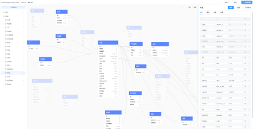
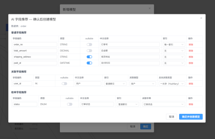
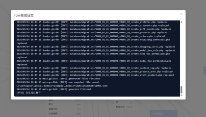

# Laravel Modeler

> Laravel Modeler 是一个面向 Laravel 项目的本地建模与代码生成工具入口包。
> 通过 Composer 安装后，可使用 Artisan 命令下载并启动 Modeler Studio / Generator，完成模型设计、关系设计，并生成 Laravel 常用代码。

## 界面预览

以下为 Modeler Studio 界面截图（从左到右为 模型画布 → AI字段推荐 → 代码生成）。

<table>
<tr>
<td align="center" valign="top" width="33%">
<a href="docs/images/1.png" title="查看原图 1"></a><br/><sub>1</sub>
</td>
<td align="center" valign="top" width="33%">
<a href="docs/images/2.png" title="查看原图 2"></a><br/><sub>2</sub>
</td>
<td align="center" valign="top" width="33%">
<a href="docs/images/3.png" title="查看原图 3"></a><br/><sub>3</sub>
</td>
</tr>
</table>

---

## 项目定位

`light2000/laravel-modeler` 是 Laravel Modeler 工具链的 Composer PHP 包，主要负责：

- 注册 Laravel Service Provider
- 提供 `php artisan modeler:*` 命令
- 管理 `.modeler` 本地工作目录
- 下载并调用 Studio / Generator 二进制程序
- 读取 Laravel 项目配置并生成 Modeler 运行配置
- 将模型设计结果用于生成 Laravel 代码

它本身不是一个完整的低代码平台，而是 Laravel 项目中的本地开发辅助工具。

---

## 功能特性

- 本地运行，不需要把项目代码上传到云端
- 通过 Composer 接入 Laravel 项目
- 支持启动可视化建模 Studio
- 支持模型、字段、枚举、关联关系设计
- 支持生成 Laravel Model / Migration / Enum 等代码
- 支持 `.modeler` 目录保存本地工具配置与二进制文件
- 支持通过环境变量自定义 Studio / Generator 路径
- 适合 Laravel 12+ 项目的模型设计与代码生成流程

---

## 环境要求

建议环境：

- PHP >= 8.2
- Laravel >= 12
- Composer 2.x
- Windows / Linux / macOS

> 注：Studio / Generator 为独立二进制程序，不同系统需要下载对应版本。

---

## 安装

在 Laravel 项目根目录执行：

```bash
composer require light2000/laravel-modeler
```

如果 Laravel 自动发现 Service Provider 正常工作，通常不需要手动注册。

---

## 初始化 / 安装二进制

安装 Composer 包后，执行：

```bash
php artisan modeler:install
```

该命令通常会完成以下工作：

- 创建 `.modeler` 工作目录
- 下载 Studio / Generator 二进制程序
- 初始化必要的配置文件
- 准备本地运行环境

目录示例：

```text
your-laravel-project/
├─ app/
├─ config/
├─ database/
├─ vendor/
└─ .modeler/
   ├─ bin/
   │  ├─ studio.exe
   │  └─ generator.exe
   ├─ runtime/
```

> Windows 下二进制通常带 `.exe` 后缀；Linux / macOS 下通常不带后缀。

---

## 启动 Studio

执行：

```bash
php artisan modeler:studio
```

命令会启动本地 Studio 服务，并在浏览器中打开可视化建模界面。

如果当前环境没有桌面或无法自动打开浏览器，可以查看命令行输出的本地访问地址，然后手动访问。

---

## 生成代码

当模型设计完成后，可通过 Studio 界面触发生成，也可以使用 Artisan 命令调用 Generator。

常见生成内容包括：

- Eloquent Model
- Migration
- PHP Enum
- Factory
- Seeder
- 关联关系代码
- 配置辅助文件

具体支持范围以当前版本的 Generator 为准。

---

## 配置

Laravel Modeler 会读取 `config/modeler.php` 或内部默认配置。常用配置项包括：

```php
return [
    'setting' => [
        'STUDIO_PATH' => env('MODELER_STUDIO_PATH', base_path('.modeler/bin/studio')),
        'GENERATOR_PATH' => env('MODELER_GENERATOR_PATH', base_path('.modeler/bin/generator')),
        'PROJECT_NAME' => env('MODELER_PROJECT_NAME', env('APP_NAME', 'Laravel')),
        'PROJECT_DIR' => env('MODELER_PROJECT_DIR', base_path()),
        'SERVER_PORT' => env('MODELER_SERVER_PORT', 'auto'),
    ],
];
```

可在 `.env` 中覆盖：

```dotenv
MODELER_STUDIO_PATH=/path/to/studio
MODELER_GENERATOR_PATH=/path/to/generator
MODELER_PROJECT_NAME="My Laravel App"
MODELER_PROJECT_DIR=/path/to/project
MODELER_SERVER_PORT=8080
```

---

## 建议加入 `.gitignore`

`.modeler` 目录通常包含本地二进制、日志、临时文件和本机配置，建议不要提交到 Git：

```gitignore
.modeler/bin/
.modeler/runtime/
```

如果你的团队希望共享模型 schema 文件，可以只提交 schema 或项目配置文件，不提交二进制文件。

---

## 安全说明

Laravel Modeler 的 Studio / Generator 是本地二进制程序。首次运行时，系统或终端可能会提示是否允许执行，这是正常现象。

建议：

- 只从官方 Release 或可信下载源获取二进制文件
- 不要运行来源不明的 Studio / Generator
- 团队项目中建议固定版本号
- 如有需要，可对二进制文件进行 hash 校验

---

## 常见问题

### 1. Composer 包是否包含 Studio / Generator？

Composer 包主要提供 Laravel 集成入口和 Artisan 命令。Studio / Generator 通常通过 `modeler:install` 下载到项目的 `.modeler/bin` 目录。

这样可以避免 Composer 包体积过大，也方便不同系统下载对应二进制。

### 2. 为什么不把二进制放到 vendor 目录？

`vendor` 目录由 Composer 管理，更新或重新安装依赖时可能被覆盖。`.modeler` 更适合存放本地工具、日志和生成器运行数据。

### 3. 没有桌面的 Linux 服务器能用吗？

可以运行命令，但 Studio 是可视化界面，通常更适合在本地开发机使用。无桌面环境下可以通过命令行生成，或将 Studio 服务地址暴露给可访问浏览器的环境。

### 4. 是否会覆盖已有代码？

生成器应尽量遵循“生成文件”和“用户自定义文件”分离的原则。实际覆盖策略请以当前版本说明和生成前提示为准。建议在 Git 工作区干净时执行生成，方便查看 diff。

### 5. 是否需要提交 `.modeler`？

通常不建议提交整个 `.modeler`。如果 schema 文件位于 `.modeler` 中，可以按团队约定只提交 schema，不提交二进制、日志和临时文件。

---

## 开发目标

Laravel Modeler 希望解决的是：

> 在 Laravel 项目早期，通过可视化模型设计快速建立稳定、清晰、可重复生成的基础Model代码。

它更关注：

- 模型结构清晰
- 生成结果可预测
- Laravel 风格一致
- 减少重复手写样板代码
- 保留开发者对业务代码的控制权

---

## License

MIT

---

## Links

- Packagist: `light2000/laravel-modeler`
- Generator: `https://github.com/light2000/laravel-modeler-generator`
- Studio: `https://github.com/light2000/laravel-modeler-studio`
